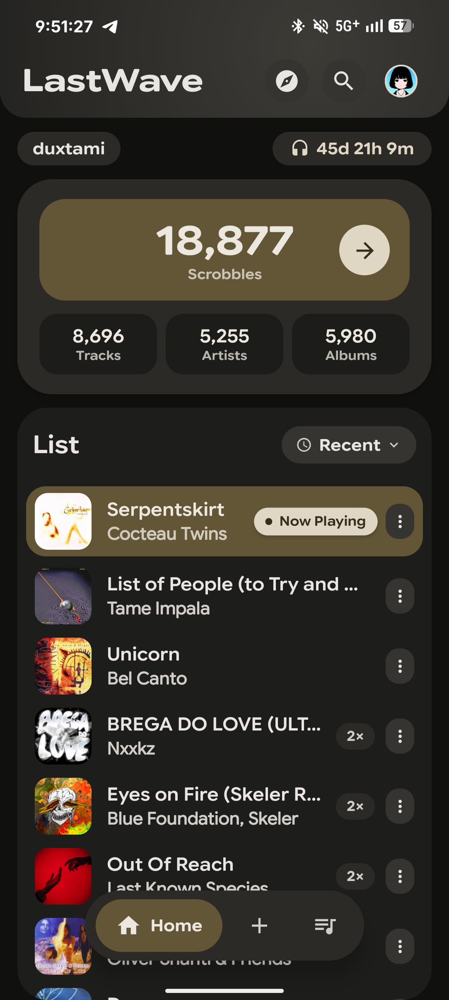
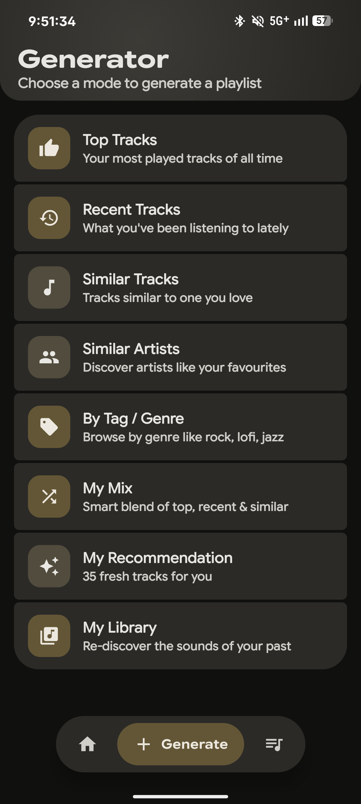
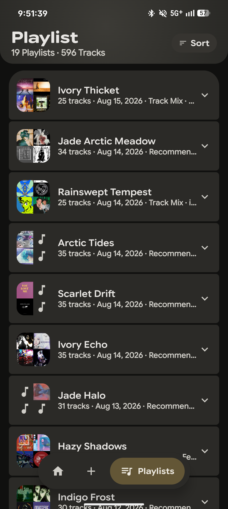
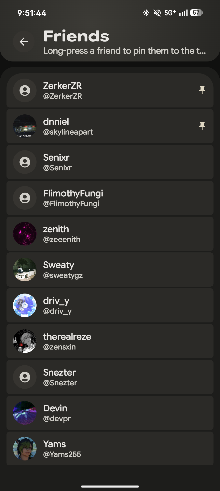
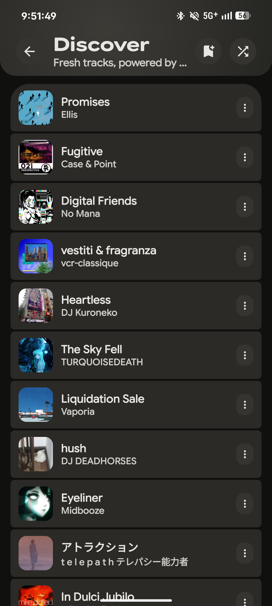
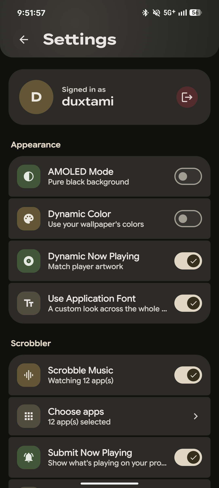
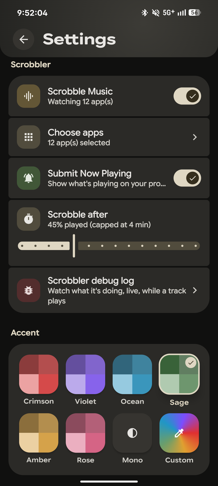

<div align="center">

# ✨ LastWave

**A fully-featured Last.fm client and scrobbler for Android, built with Material 3 Expressive design.**

<p align="center">
  <a href="https://github.com/duxtami/LastWave-native/stargazers">
    
  </a>
  <a href="https://github.com/duxtami/LastWave-native/network/members">
    
  </a>
  <a href="#">
    
  </a>
</p>

</div>

<br/>

<div align="center">
  
  
  
  
  
  
  
</div>

<br/>

## ✨ Highlights
- 🎵 **Native Android app** — Built entirely with Jetpack Compose, targeting a flawless Material 3 Expressive feel.
- 🔐 **One-tap Last.fm sign-in** — Secure web-auth flow via Chrome; no password is ever typed into the app.
- 📡 **Built-in local scrobbler** — Seamlessly detects what's playing from any app on your phone and scrobbles it to Last.fm automatically, completely eliminating the need for a third-party scrobbler.

---

## 🎧 Core Features

| Feature | Description |
|:---|:---|
| 🏠 **Home Feed** | Track recent plays, most played, and top tracks across periods (7 days / 30 days / all-time) with a live "Now Playing" status. |
| 🔮 **Discover** | Dive into a personalized recommendation feed blending similar tracks, similar artists, loved tracks, tags, and global charts. |
| 🎸 **Genres** | Deep dive into detailed genre breakdowns and comprehensive listening analytics. |
| 🪄 **Playlist Generator** | Instantly create smart playlists straight from Last.fm data|
| 🔍 **Search** | Effortlessly find tracks, artists, albums, and even other Last.fm users. |
| 👥 **Friends** | Seamlessly switch to and browse any of your Last.fm friends' profiles and stats in an instant. |
| ⚙️ **Settings** | Enjoy full backup & restore capabilities alongside rich appearance customizations. |

---

## 🎚️ Custom Scrobbler *(Built from Scratch)*

> **A robust scrobbler designed to 'just work' seamlessly in the background.**

- **Universal Detection**: Detects now-playing status natively via Android's MediaSession framework, working out-of-the-box with any music or streaming app you use.
- **Granular Control**: Configurable per-app selection with smartly auto-detected music players.
- **Adjustable Threshold**: Fine-tune your required scrobble threshold (% played).
- **Edge-Case Handling**: Intelligently manages repeat tracks, resume actions, and multi-app switching without missing a beat.
- **Smart Cleanup**: Automatically cleans up pesky YouTube Music "Topic" channel artist names for pristine Last.fm logs.
- **Real-Time Insights**: Includes a live debug log so you can peek under the hood and see exactly what it’s doing in real time.

---

## 🎨 Premium Design

> **Crafted meticulously with Material 3 Expressive guidelines.**

- **Expressive Components**: Custom shapes, organically grouped containers, real press animations, and satisfying haptic feedback throughout.
- **Dynamic Theming**: Adapts to your wallpaper using Material You dynamic color, plus a stunning "Dynamic Now Playing" theme that extracts and applies accent colors directly from the currently playing track's artwork.
- **Predictive Back Support**: Native Android Predictive Back gesture support for fluid, predictive navigation.
- **Custom Typography**: Tailored variable typography powered by Google Sans Flex for a sleek, modern finish.

---

## 🛠️ Tech Stack

Built modern from the ground up:
- **Kotlin + Jetpack Compose**
- **Hilt** (Dependency Injection), **Room** (Local DB), **DataStore** (Preferences)
- **Retrofit + OkHttp** (Networking)
- **Last.fm API Integration**

<br/>

## 🚀 Getting Started

1. **Install LastWave** on your Android device.
2. Open the app and simply tap **Sign In** to authenticate via Last.fm securely using Chrome.
3. Allow **Notification Access** so the built-in scrobbler can detect your currently playing music.
4. Enjoy! Your stats, feeds, and smart playlists will load automatically.

## 💻 Building from Source

```bash
git clone https://github.com/duxtami/LastWave-native.git
cd LastWave-native
./gradlew assembleDebug
```

<div align="center">
  <p>Crafted with 💖 and Material Design 3. Belonging to <a href="https://github.com/duxtami">DUXTAMI</a>.</p>
</div>
